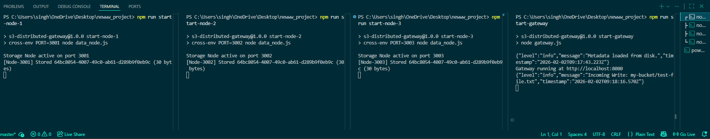

# ☁️ Distributed S3-Compatible Object Storage Gateway


-orange?style=flat)


A resilient, distributed object storage system built from scratch in Node.js. It features **Strong Consistency** via Quorum writes, **High Availability** through replication, and **Self-Healing** capabilities.

This project simulates a cloud-native storage architecture (like AWS S3) with a Gateway service and isolated Data Nodes.

---

## 📸 System Demo
*Running the full distributed cluster locally: 3 Storage Nodes + 1 Gateway.*



---

## 🏗️ Architecture

The system follows a **Leaderless Replication** model managed by a central Gateway.

```mermaid
    graph TD
        C["Client (curl app)"] -->|HTTP PUT/GET| G
        subgraph Distributed_Cluster
            G["Gateway Service"] -->|Replicate| N1["Data Node 1"]
            G -->|Replicate| N2["Data Node 2"]
            G -->|Replicate| N3["Data Node 3"]
        end
        G -.->|Metrics| P["Observability"]

````

---

### 🔑 Key Technical Features

* **🛡️ Quorum Consensus:**
  Writes are acknowledged only when `W` nodes confirm storage
  *(Configured `W = 2` for a 3-node cluster)*

* **🔄 Automated Self-Healing:**

  * **Read Repair:**
    If a read hits a stale replica, the Gateway fetches from a valid node and updates the stale one.
  * **Background Workers:**
    Async workers continuously scan for `replication_lag` and retry failed writes to ensure eventual consistency.

* **📊 Observability First:**
  Built-in Prometheus metrics endpoint tracking:

  * `storage_errors`
  * `latency`
  * `replication_lag`

* **🗂️ Versioning:**
  Supports object versioning, enabling retrieval of previous object states.

* **🔒 Data Integrity:**
  End-to-end MD5 checksum validation to detect bit-rot or corruption during network transfer.

---

## 🚀 Getting Started

### Prerequisites

* Node.js (v14+)
* NPM

---

### Installation

```bash
git clone https://github.com/your-username/s3-distributed-gateway.git
cd s3-distributed-gateway
npm install
```

---

### Running the Cluster

You need to spin up both the **storage layer** (data nodes) and the **access layer** (gateway).

#### 1️⃣ Start Storage Nodes

*(Run in 3 separate terminals)*

```bash
npm run start-node-1   # Runs on port 3001
npm run start-node-2   # Runs on port 3002
npm run start-node-3   # Runs on port 3003
```

#### 2️⃣ Start the Gateway

*(Run in a 4th terminal)*

```bash
npm run start-gateway  # Runs on port 8080
```

---

## 📡 API Usage

### 1️⃣ Upload Object (PUT)

The Gateway stores the object and replicates it across the cluster.

```bash
curl -X PUT -H "Content-Type: application/octet-stream" \
     --data "Hello Distributed World" \
     http://localhost:8080/s3/my-bucket/file1.txt
```

**Response**

```json
{
  "message": "Uploaded",
  "versionId": "75182327-9e95-4db5-ab4e-a9c51e546e35"
}
```

---

### 2️⃣ Retrieve Object (GET)

Fetches the object from the nearest healthy replica.

```bash
curl http://localhost:8080/s3/my-bucket/file1.txt
```

---

### 3️⃣ Check Metrics

Monitor real-time cluster health.

```bash
curl http://localhost:8080/metrics
```

---

## 📊 Observability & Metrics

The system exposes metrics compatible with Prometheus and Grafana.

| Metric                  | Description                            |
| ----------------------- | -------------------------------------- |
| `storage_errors`        | Counter for failed read/write attempts |
| `replication_lag`       | Number of objects pending repair       |
| `http_request_duration` | Gateway request latency histogram      |

---

## 🧪 Chaos Engineering (Proof of Reliability)

**Kill Test — Demonstrating Fault Tolerance**

1️⃣ **Kill a Node**
Stop `Node-3` using `CTRL + C`

2️⃣ **Write Data**

```bash
curl -X PUT --data "Chaos Test" http://localhost:8080/s3/test/file.txt
```

✅ **Result:** Write succeeds
Quorum (`W = 2`) is still satisfied.

**Gateway Log**

```
[Warn] Quorum met, but nodes failed. Scheduling repair.
```

3️⃣ **Verify Lag**

```bash
curl http://localhost:8080/metrics
```

`replication_lag = 1`

4️⃣ **Revive Node**
Restart `Node-3`

5️⃣ **Self-Healing**
Background worker syncs missing data
`replication_lag → 0`

---

## 💻 Internal Architecture

*A peek into the Gateway's write-path logic handling replication, quorum checks, and metadata updates.*
